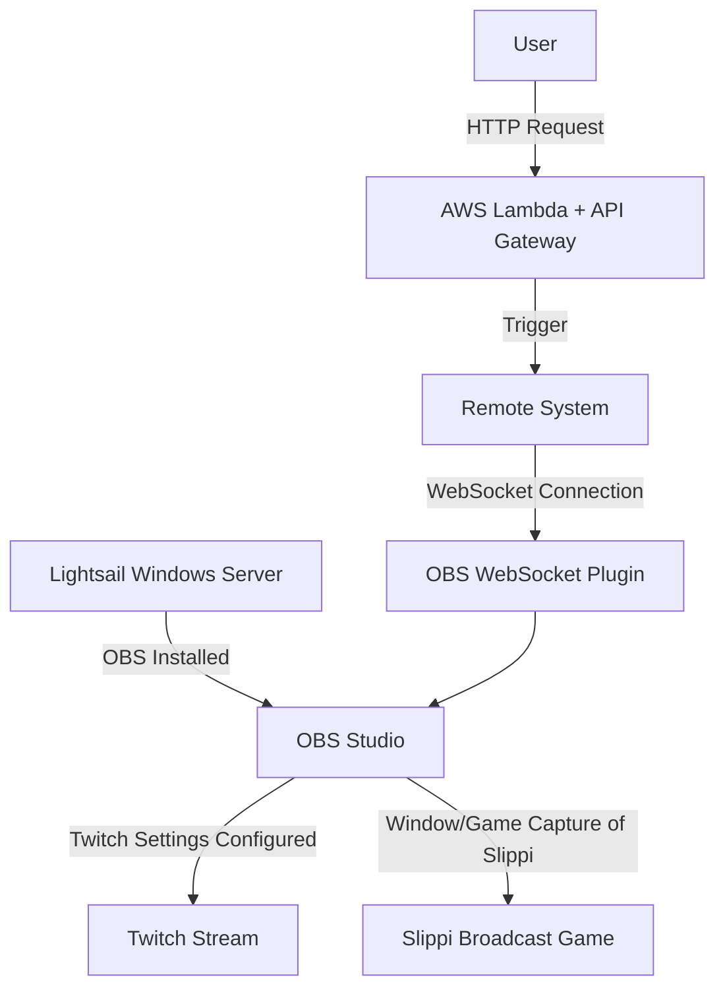

```mermaid
graph TD

A[Lightsail Windows Server] -->|OBS Installed| B[OBS Studio]
B -->|Twitch Settings Configured| C[Twitch Stream]
B -->|Window/Game Capture of Slippi| D[Slippi Broadcast Game]

E[Remote System] -->|WebSocket Connection| F[OBS WebSocket Plugin]
F --> B

G[AWS Lambda + API Gateway] -->|Trigger| E

H[User] -->|HTTP Request| G

```
